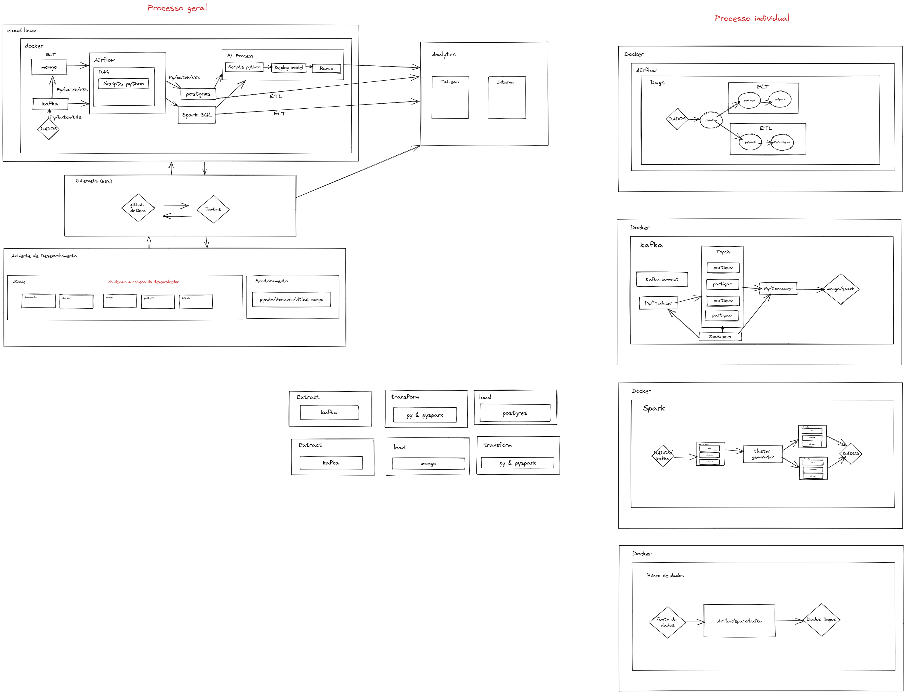

# Arquitetura Cloud 🌩

## **Cenarios possiveis**

A Arquitetura montada se baseia em 1 cenário:

1. Apenas 1 maquina com sistema operacional linux

Dito isso teremos interações diferentes em cada contexto para o relacionamento com cada ferramenta

# Peça central da arquitetura interna "spark"

Peças centrais da arquitetura geral

1. spark
2. airflow
3. Docker/kubernetes
4. jenkins

## **Ambientes da arquitetura**

> Ambiente de ETL

- Kafka >> Spark >> PostgreSQL >> Tableau

> Ambiente de ELT

- Kafka >> MongoDB >> Spark >> Tableau

> Ambiente ML

- `Ambiente de ELT` >> Python >> kubeflow >> Model >> Deploy (API)

- `Ambiente de ETL` >> Python >> Kubeflow >> Model >> Deploy (API)

> Ambiente de gerenciamento

- Docker >> kubernetes >> Airflow

> Ambiente de CI/CD e DevOps

- Git Hub >> Jenkins >> Kubernetes >> Docker >> Airflow

> Ambiente de Desenvolvimento

- VSCode (extensões e programas) >> GitHub >> Jenkins >> Kubernetes >> produção

## **Conexão entre as ambientes ?**

### Ambiente de gerenciamento >> Ambiente de CI/CD e DevOps

    Essa conexao e feita pelo jenkins diretamente no airflow para que possa subir os dags para a transformaçoes eos Scripts

### Ambiente de gerenciamento >> Ambiente ML

    Conexao feita pelo jenkins, kubernets e kubeflow para subir os modelos de machine learning

### Ambiente de gerenciamento >> Ambiente de ELT

### Ambiente de gerenciamento >> Ambiente de ETL

### Ambiente de gerenciamento >> Ambiente de Desenvolvimento

### Ambiente de ETL >> Ambiente ML

### Ambiente de ETL >> Ambiente de CI/CD e DevOps

### Ambiente de ETL >> Ambiente de Desenvolvimento

### Ambiente de ELT >> Ambiente ML

### Ambiente de ELT >> Ambiente de CI/CD e DevOps

### Ambiente de ELT >> Ambiente de Desenvolvimento

### Ambiente ML >> Ambiente de Desenvolvimento

### Ambiente ML >> Ambiente de CI/CD e DevOps

## **Como ea Conexão entre as ferramentas ?**

- Quando vc instala uma ferramenta em container ela funciona normalmente no seu ambiente local

- Cada ferramenta tem seu relacionamento especifico com outras ferramentas mas todas tem em comuns o fato de estarem fazendo network de bridge com outros containers que tem outras ferramentas e logo depois fazendo a conexão normal como se estivesse local

- Essa conexão local e feita muitas vesses por requisições http e ftp/ip e para isso usaremos os scripts em python em Django e as ferramentas em containers como [Ngrok](https://ngrok.com/),[Ngrok docker hub](https://hub.docker.com/r/ngrok/ngrok)

## **Diagrama**

Modelo com todos os ambientes e tecnologias usadas na arquitetura da nuvem. e suas arquiteturas individuais para seber o funcionamento interno de cada ferramenta do sistema. Todas elas estao melhores explicadas em seus readmes

**Modelo definitivo ate o momento :**

**Links de apoio :**

[Arquitetura](https://www.vmware.com/br/topics/glossary/content/cloud-architecture.html)

[Clean Architecture](https://www.youtube.com/watch?v=ow8UUjS5vzU)
