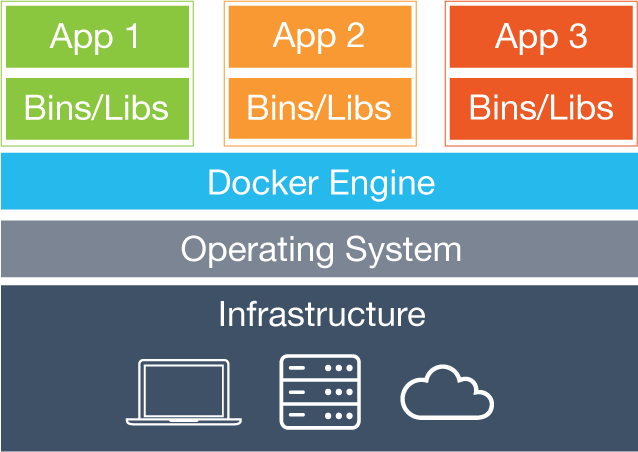

</img>

# **Oque e ?**

**Docker** é uma plataforma Open Source que possibilita o empacotamento de uma aplicação dentro de um contêiner. A partir desse momento, um software consegue se adequar e rodar em qualquer máquina que tenha essa tecnologia instalada.

Determinada imagem recebe uma camada de RW (READ/Write), em outras palavras, a imagem original do arquivo recebe uma camada de aplicação extra no qual é possível armazenar todas as configurações de determinados conteiners.

[Documentação](https://docs.docker.com/)

# **Para que serve?**

O Docker é uma plataforma open source que facilita a criação e administração de ambientes isolados. Ele possibilita o empacotamento de uma aplicação ou ambiente dentro de um container, se tornando portátil para qualquer outro host que contenha o Docker instalado.

# **Como funciona ?**

O Docker é uma plataforma open source que facilita a criação e administração de ambientes isolados. Ele possibilita o empacotamento de uma aplicação ou ambiente dentro de um Contêiner, se tornando portátil para qualquer outro host que contenha o Docker instalado.

# **Qual é a Arquitetura ?**

# **Como instalar ?**

O processo de instalação é muito simples!
Basta seguir a documentação recomendada que é possível produzir um resultado adequado.

- [Guia de Instalação do Docker](https://docs.docker.com/engine/install/ubuntu/);
- [Guia de Pós-Instalação do Docker](https://docs.docker.com/engine/install/linux-postinstall/);
- [MOntagem de um dockerfile](https://www.macoratti.net/19/02/dock_imgfile1.htm)
- Selecionar a opção no momento da instalação do SO do Servidor LINUX

- Para instalação e preciso de um certo poder computacional e alguns pré-requisitos para que sua máquina virtual funcione

- Atributos para ter uma VM funcional
  - Memória : pelo menos 100GB
  - Memória RAM : Pelo menos metade da capacidade do seu PC
  - OS: Ubunto server

# **Como funciona dentro na nuvem ?**

Através da conexão em rede em conjunto com a liberação das portas do Firewall, através desse processo é possível criar um vínculo entre os dois ambientes de produção e desenvolvimento para utilização das rotas livremente.

Abaixo está tutorial disponibilizado pelo nosso serviço CLOUD (CONTABO) acerca desse tipo de configuração.

[Contabo](https://contabo.com/blog/the-ultimate-guide-to-docker-installation-and-deployment-using-cloud-init/#why-should-i-use-docker)

# **Quais são suas dependências ?**

- O sistema do Docker é dividido basicamente em quatro partes: Docker Server e Daemon, imagens, registros, e Contêiners.

- Se for no Windows é necessário a instalação e configuração WSL2.

- Camada de Subsistema que pode ser executado no Windows 10, Windows 11 e Windows Server 2019 em adiante.

# **Componentes Docker**

O Docker possui alguns componentes.

[Docker http](https://docs.docker.com/desktop/networking/#use-cases-and-workarounds)

## **Principais Componentes**

- **Contêiner**: Serve para armazenar as informações de maneira clusterização, ou seja, inserir as informações em um espaço específico no qual é possível manter configurações específicas para determinados tipos de imagem.
- **Imagem**: É um item que contém todas as informações de determinadas aplicações.
- **Camada**: Trata-se de uma configuração específica que pode efetuar a operação de Leitura ou Escrita, no caso do Docker, essa camada permite a criação de diversas configurações sem alterar a imagem original.

## **Ferramentas Docker**

Antes de instalar qualquer Contêiner ou imagem faça instalação das ferramentas a seguir:

- [Kubernetes](../k8s/README.md)
- [Portainer](https://hub.docker.com/r/portainer/portainer-ce)
  - [Video Portainer](https://www.youtube.com/watch?v=hz5F8vyTJr4)
- [nginxdemos](https://hub.docker.com/r/nginxdemos/hello)
- [jupyter/pyspark-notebook](https://hub.docker.com/r/jupyter/pyspark-notebook)
- [kafdrop](https://hub.docker.com/r/obsidiandynamics/kafdrop)
- [Docker hub](https://hub.docker.com/)

`Docker compose cria o Contêiner e Dockerfile cria a imagem`

## **Dockerfile**

É utilizado para setar as variáveis de cada imagem tendo suas configurações e suas dependências gravadas corretamente

[Documentação](https://docs.docker.com/engine/reference/builder/)

## **Docker-compose**

O Docker Compose ajuda a definir e compartilhar aplicativos de vários contêineres. Com o Docker Compose, você pode criar um arquivo para definir os serviços. Com um único comando, você pode criar tudo ou derrubá-lo

## **Network**

&#10139; Antes de começar e necessário conhecimento de redes para trabalhar nessa parte

O `NETWORK` do Contêiner e feita pelo `IPV4` ou `IPV6` e é referenciada pela `porta` de cada Contêiner e seu `IP` dentro de seu `docker-compose` e `dockerfile`. Para melhor funcionamento e acompanhamento através de GUI (Interface Gráfica) é utilizado o _Portainer_.

- Tudo é feito pelo compose, que é o arquivo de configuração.
- Cada ferramenta tem seu compose.
- Pode se fazer um compose unificado para todas as ferramentas.

O processo de network é realizado através das configuração da rede local, afinal estão compartilhando a mesma rede, sendo necessário apena a configuração das portas.

Melhor configuração de network é feito em host para que os Contêiner sejam usados em ambiente de desenvolvimento e possa subir pelo Jupyter

[Network create](https://docs.docker.com/engine/reference/commandline/network_create/)

[Tutorial rede bribed](https://docs.docker.com/network/network-tutorial-standalone/)

[Redes em Geral](https://stack.desenvolvedor.expert/appendix/docker/rede.html)

[Redes no Docker Video](https://www.youtube.com/watch?v=OmZdItNjWNY)

[Explicando Portas](https://www.youtube.com/watch?v=6by0pCRQdsI)

[Manipulando Portas](https://www.youtube.com/watch?v=PMhXNkwbRis)

[DNS Docker](https://www.youtube.com/watch?v=0OzLFvklZas&list=PLg7nVxv7fa6dxsV1ftKI8FAm4YD6iZuI4&index=7)

[Host docker](https://docs.docker.com/network/network-tutorial-host/)

## **Images**

A imagem é um arquivo e o conteiner é um processo. Docker é um serviço de contêiner de software que se tornou bastante popular na implantação de aplicativos. Basicamente, ele permite que você empacote o software de uma forma conceitualmente semelhante a uma máquina virtual

## **Volume**

Volumes nada mais são que diretórios externos ao Contêiner, que são montados diretamente nele, e dessa forma bypass's seu filesystem, ou seja, não seguem aquele padrão de camadas que falamos.

## **TAG**

Tag, é uma abstração para criar unidade dentro do conjunto de imagens definidas no “repositório”. Um “repositório” pode conter mais de uma “tag” e cada conjunto repositório:tag representa uma imagem diferente

# **Como usar ?**

Docker será utilizado como serviço majoritariamente no ambiente de desenvolvimento que no caso é o `VSCODE` criando e manipulando os contêineres para uso dos desenvolvedores das ferramentas possibilitando flexibilidade e melhor uso dos processos.

[Link Auxiliar com Maiores Atalhos](https://dockerlabs.collabnix.com/docker/cheatsheet/)

[Alguns outros Comandos](https://docs.docker.com/engine/reference/commandline/ps/)

[Remover Itens](https://www.macoratti.net/19/02/dock_limp1.htm)

# **Uso do Python ?**

O uso do python é para configuraçao externa e network com os demais Contêiner

[Exemplos de Scripts Python para Docker](https://www.youtube.com/watch?v=bi0cKgmRuiA)

# **Como se encaixa em todo o processo ?**

Juntamente com o Airflow server para gerenciamento e orquestramento dos ambientes.

> **Onde vai para cada fluxo de dados da ferramenta ?**

O Docker hospeda todo o processo de dados.

> **De qual processo ela faz parte ?**

Gerenciamento

> **Como dar Deploy da aplicação ?**

[Contêiner online](https://www.youtube.com/watch?v=97jWpWp4Pnc)

[Desenvolvimento X Homologado Deploy alternativo docker](https://pt.stackoverflow.com/questions/141587/processo-de-desenvolvimento-com-docker)

[docker ambiente de homologaçao](https://gist.github.com/tsfreitas/4ae2eb5eb721f27b4fd0)

[Docker config host deployment](https://contabo.com/blog/configuring-additional-ip-addresses/)

[Intall docker compose pluguin](https://docs.docker.com/compose/install/linux/#install-using-the-repository)