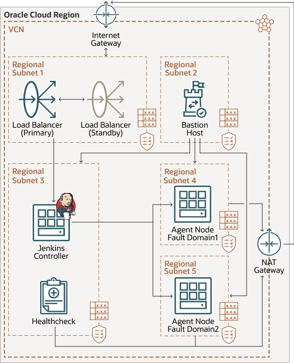

</img>

# **Oque e ?**

Jenkins é um servidor de automação de código aberto. Com o Jenkins, as organizações podem acelerar o processo de desenvolvimento de software automatizando-o.

[Documentation](https://www.jenkins.io/doc/)

# **Para que serve ?**

- O Jenkins gerencia e controla os processos de entrega de software em todo o ciclo de vida, incluindo construção, documento, teste, pacote, estágio, implantação, análise de código estático e muito mais.

- Jenkins é usado para construir e testar o seu produto continuamente, para que os desenvolvedores possam integrar continuamente as mudanças na construção. Jenkins é a ferramenta de CI / CD de código aberto mais popular no mercado hoje e é usado no suporte de DevOps, junto com outras ferramentas nativas da nuvem.

[Airflow x Jenkins](https://www.educba.com/airflow-vs-jenkins/)

# **Como funciona ?**

O Jenkins aciona uma construção a cada confirmação para o repositório de código-fonte, normalmente para um branch de desenvolvimento.

Jenkins pode ser configurado para executar um conjunto inicial de testes de unidade para garantir que o commit não “quebrou a compilação”. Se os testes não passarem, o desenvolvedor pode ser notificado imediatamente para tomar uma ação corretiva. Isso põe de lado a questão de “Quem quebrou o build?” pois é fácil determinar qual confirmação causou a falha da compilação. Se todos os testes de unidade forem aprovados, o pipeline de construção pode prosseguir para a próxima fase com testes de integração que geralmente levam mais tempo para serem executados.

# **Qual e a Arquitetura ?**

[Arquitetura CI/CD Azure](https://docs.microsoft.com/pt-br/azure/architecture/solution-ideas/articles/container-cicd-using-jenkins-and-kubernetes-on-azure-container-service)

[Arquitetura CI/CD GCP](https://cloud.google.com/architecture/continuous-delivery-jenkins-kubernetes-engine?hl=pt-br)

# **Como instalar ?**

[Video Install Container](https://www.youtube.com/watch?v=DPLcZQy0lcY)

## **Acesse Seu VPS**

Acesse seu VPS usando SSH. Se você está com problemas, confira nosso tutorial PuTTY.

## **Instale JDK**

O primeiro pré-requisito do Jenkins é JDK. O comando seguinte vai instalar JDK e JRE:

    sudo apt-get install openjdk-8-jdk

## **Instale um Servidor Web**

A primeira coisa que você precisa é um servidor web como Apache ou Nginx. Você pode instalar o servidor web de sua preferência. Neste tutorial, usaremos o Nginx.

Para instalar Nginx no seu VPS, execute o seguinte comando na linha de comando:

    sudo apt-get install nginx

Certifique-se que Nginx está ativo e funcionando na sua máquina Ubuntu ao digitar o IP do seu servidor no seu navegador web e clique em enter. Você deve receber a mensagem de boa-vinda do Nginx da sua tela.

## **Instale Jenkins**

Agora vamos instalar o Jenkins. Submeta os quatro comandos abaixo em sequência para instalar Jenkins no Ubuntu:

    wget -q -O - https://pkg.jenkins.io/debian/jenkins-ci.org.key | sudo apt-key add -

    sudo sh -c 'echo deb http://pkg.jenkins.io/debian-stable binary/ > /etc/apt/sources.list.d/jenkins.list'

    sudo apt-get update

    sudo apt-get install jenkins

## **Insira a Senha do Administrador**

Por padrão, o Jenkins vai executar o portão 8080. Para iniciar o Jenkins, insira o IP do seu VPS e o número do portão. No seu navegador, a informação ficará parecida com isso – 120.0.0.1:8080.

Será solicitado que você insira a senha do administrador. Você pode encontrar a senha no arquivo /var/lib/jenkins/secrets/initialAdminPassword. Você também pode usar o comando cat para exibir a senha:

    cat /var/lib/jenkins/secrets/initialAdminPassword

Copie a senha no campo Administrator password e pressione enter.

## **Personalize o Jenkins**

Em seguida, você verá uma tela com sugestões de plugins para instalar, e que nós também recomendamos.

## **Defina o Nome do Usuário e Senha para Jenkins**

Agora, você pode definir o nome do usuário e senha na tela seguinte. Depois disso, você será direcionado para o painel de controle, onde poderá começar o trabalho!

[Video explicativo assitir tudo](https://www.youtube.com/watch?v=8OfhS5f7jIY)

[jenkinsci](https://github.com/jenkinsci/docker)

[HazemElHaouari](https://github.com/HazemElHaouari/Tutorial-Kubernetes-jenkins-docker-vps)

[antonpinchuk](https://github.com/antonpinchuk/node-jenkins-demo)

[alura](https://www.alura.com.br/conteudo/pipeline-ci-jenkins-docker)

# **Como funciona dentro do container ?**

jenkins nao fica dentro do container do docker ele interage de forma externa subindo os arquivos de construção de containers para seus determinados locais de uso com suas aplicações

[Integraçao](https://medium.com/@amankedia1402/integrating-kubernetes-with-jenkins-github-and-docker-6cbdb4aae603)

[Video explicativo assitir tudo](https://www.youtube.com/watch?v=8OfhS5f7jIY)

# **Quais sao suas dependencias ?**

- [JDK](https://www.jenkins.io/doc/administration/requirements/java/)
- [git](https://imasters.com.br/back-end/serie-continuous-integration-conectando-jenkins-com-github)

# **Componentes ?**

## **Instância do controlador do Jenkins**

Essa instância de Computação virtual atua como o nó controlador. Ele monitora o estado das instâncias do agente (off-line ou on-line) e recebe respostas do resultado da tarefa dos agentes.

## **Instâncias do agente do Jenkins**

Essas instâncias do serviço Compute virtuais agem como nós de agente. O nó do controlador cria-os conforme necessário e eles executam quaisquer jobs conforme direcionado pelo nó do controlador.

## **Região**

Uma região do Oracle Cloud Infrastructure é uma área geográfica localizada que contém um ou mais data centers, chamados domínios de disponibilidade. As regiões são independentes de outras regiões e grandes distâncias podem separá-las (entre países ou mesmo continentes).

## **Rede virtual na nuvem (VCN) e sub-redes**

Cada instância do serviço Compute é implantada em uma VCN que pode ser segmentada em sub-redes.

## **Domínios de disponibilidade**

Os domínios de disponibilidade são data centers independentes e independentes em uma região. Os recursos físicos em cada domínio de disponibilidade são isolados dos recursos nos outros domínios de disponibilidade, o que fornece tolerância a falhas. Os domínios de disponibilidade não compartilham infraestrutura, como energia ou resfriamento, ou a rede interna de domínios de disponibilidade. Portanto, é improvável que uma falha em um domínio de disponibilidade afete os outros domínios de disponibilidade na região.

## **Domínios com falha**

Um domínio de falha é um agrupamento de hardware e infraestrutura dentro de um domínio de disponibilidade. Cada domínio de disponibilidade tem três domínios de falha com energia e hardware independentes. Quando você distribui recursos entre vários domínios de falha, seus aplicativos podem tolerar falhas físicas do servidor, manutenção do sistema e falhas de energia dentro de um domínio de falha.

## **Balanceador de carga**

O balanceador de carga distribui o tráfego de entrada para o nó do controlador do Jenkins e fornece acesso à internet para os usuários que acessam o nó do controlador. Recomendamos o uso de um balanceador de carga de 100 Mbps porque ele será usado principalmente para estabelecer conexão com o controlador do Jenkins e o fluxo de tráfego de volta para o usuário não será pesado.

## **Gateway NAT**

Um gateway NAT (Network Address Translation) fornece um serviço NAT. Você não precisa escolher o tamanho do gateway

## **Bastion host**

O bastion host é uma instância de computação que serve como ponto de entrada seguro e controlado para a topologia de fora da nuvem. O bastion host geralmente é provisionado em uma zona desmilitarizada (DMZ). Ele permite proteger recursos confidenciais colocando-os nas redes privadas que não podem ser acessadas diretamente de fora da nuvem. A topologia tem um único ponto de entrada conhecido que você pode monitorar e auditar regularmente. Portanto, você pode evitar expor os componentes mais confidenciais da topologia sem comprometer o acesso a eles.

## **Listas de segurança**

Para cada sub-rede, você pode criar regras de segurança que especifiquem a origem, o destino e o tipo de tráfego que devem ser permitidos dentro e fora da sub-rede.

## **Tabela de roteamento**

As tabelas de roteamento virtual contêm regras para rotear o tráfego de sub-redes para destinos fora de uma VCN, geralmente por meio de gateways.

# **Como usar ?**

[Video explicativo assitir tudo](https://www.youtube.com/watch?v=8OfhS5f7jIY)

# **Uso do Python ?**

O codigo em python vai subir para o repositorio e vai para o para o jenkins para que possa executar os testes e os demais serviços

# **Como se encaixa em todo o processo ?**

Jenkins é usado para construir e testar o seu produto continuamente, para que os desenvolvedores possam integrar continuamente as mudanças na construção. Jenkins é a ferramenta de CI / CD de código aberto mais popular no mercado hoje e é usado no suporte de DevOps, junto com outras ferramentas nativas da nuvem

> **Onde vai para cada fluxo de dados da ferramenta ?**

Os dados vao sair do repositório do git hub e vao para as demais funcionalidades do sistema para que possa ser processado e testado

> **De qual processo ela faz parte ?**

O jenkins se encarrega da etapa de integração de códigos em produção mantendo um fluxo de trabalho continuo

> **Como dar deploy da aplicação ?**

Deploy ML

[Modelo de ML Jenkins X](https://jenkins-x.io/about/concepts/version-stream/)

[Jenkins X & Kubernetes](https://medium.com/edureka/jenkins-x-d87c0271af57)

Deploy de codigo normal para ETL & ELT

[Pipeline](https://www.jenkins.io/doc/pipeline/tour/deployment/)

[Jenkins Infnet](https://www.youtube.com/watch?v=9x1gy9JsZWI)

[Video deploy](https://www.youtube.com/watch?v=vBoOXP6BkDI)

[API Contabo](https://api.contabo.com/?_gl=1*zpq68z*_ga*MTc4MzQwNzY1NS4xNjU5MTE1ODIx*_ga_YFPNZBGTF3*MTY2MjE0NTk2Mi4xNC4wLjE2NjIxNDU5NjIuMC4wLjA.#tag/Instances/operation/createInstance)

[web server python](https://imasters.com.br/back-end/criando-um-servidor-http-web-com-python)

[Expondo as portas NGrok](https://abhishek1987.medium.com/expose-kubernetes-services-with-ngrok-65280142dab4)

[jenkins e airflow deploy](https://github.com/apache/airflow/blob/main/airflow/providers/jenkins/hooks/jenkins.py)
